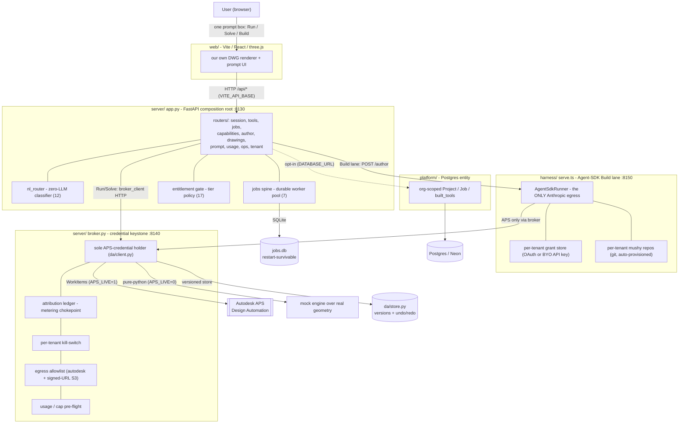

# Architecture — Leaf platform

The component map for the natural-language CAD-tool-building platform. This is the
hosted web lane (Lane 2) of the fleet mission — see `~/.claude/MISSION.md` for
identity and the honest spiked-vs-bet ledger. The unified single-prompt surface it
serves is the claude.ai design **`20ab544c9f6b` ("Unified Surface")**.

For endpoint-level behavior read `contract/CONTRACT.md` (§1–§6, frozen) and
`server/CONTRACT-ADDENDUM.md` (§7–§17). This document is the shape, not the spec.

---

## The one-screen picture

---

## Components

| Component | Path | Process / port | Role |
|---|---|---|---|
| **web** | `web/` | Vite dev `:5175` (nginx `:8080` in compose) | Our three.js DWG renderer + the single prompt surface. `VITE_MOCK=1` demos with no backend; `=0` hits the live app. |
| **app** | `server/app.py` + `server/routers/` | FastAPI `:8130` (`0.0.0.0`) | Tenant-facing composition root. 10 bare routers, no prefixes. Owns the async job spine, catalog fold, NL router, entitlement gate. **Holds no APS credential.** |
| **jobs spine** | `server/jobs.py` | in-app worker pool + SQLite | `POST /api/run` → `202 {job_id}`; durable `jobs.db` records survive an app restart; SSE/poll to a terminal §3 envelope (§7). |
| **broker** | `server/broker.py` + `da/` | FastAPI `:8140` (loopback) | **The credential keystone.** The ONLY process that reads `~/.aps/credentials.json`. Attribution ledger, kill-switch, egress allowlist, usage/cap pre-flight, versioned store (§8). |
| **harness** | `harness/` (TypeScript) | Node `:8150` | The **Build lane**. `AgentSdkRunner` is the only Anthropic egress; per-tenant grant store + auto-provisioned mushy repos; reaches APS only through the broker (§15/§16). |
| **platform** | `platform/` | Postgres (opt-in) | Canonical org-scoped **Project / Job / built_tools** entity + offboarding cascade. Dark unless `DATABASE_URL` is set. |
| **engine / da** | `engine/`, `da/` | libraries | Read tools + registry + compiled AppBundles (`engine/`); APS DA client, versioned store, fair queue, usage/reaper (`da/`). |

---

## The two keystones

### 1. The credential broker (§8) — the security spine

The tenant-facing app process **never holds the APS credential**. It is statically
verifiable (`app.py`/`jobs.py` contain no `da` import) and dynamically verifiable
(the app runs correctly with `APS_CRED=/nonexistent`). All execution flows
`app → server/broker_client.py → HTTP → broker`. The broker:

- is the **only** code that can read `~/.aps/credentials.json` and call `da/client.py`;
- appends exactly **one attribution ledger line** per `/broker/run` (including
  kill-switch denials) — the metering/quota chokepoint other surfaces read;
- enforces a per-tenant **kill-switch** (`TENANT_DISABLED`, APS never touched) and
  a **usage/cap pre-flight** (`quota_exceeded`, HTTP 402, APS never touched);
- guards **egress** with an in-process allowlist (`developer.api.autodesk.com` +
  `*.amazonaws.com` signed-URL S3), so tenant-authored `engine_op`s cannot redirect
  network traffic.

The Build-lane harness is subject to the same rule: it performs CAD execution
**only** through the broker; its **only** outbound identity egress is the Agent SDK
on the author path.

### 2. Tenant scoping — every surface is per-tenant

`server/tenant_paths.py::resolve_tenant_repo_dir` is the single source of truth for
"where does tenant X's mushy repo live," shared by the app's catalog fold and the
harness's entry resolution so they always agree (§16.A). From it flows:

- **Catalog isolation** — `/api/tools` and `/api/capabilities` fold **only the
  requesting tenant's** repo tools; the engine registry, write seed, and global
  authored store stay global. Tenant A's authored tools are invisible to tenant B.
- **Grant isolation** — one Claude grant per tenant (OAuth "sign in with Claude" or
  BYO Anthropic API key), stored server-side, **never** logged or echoed (§16.B/§17.A).
- **Repo isolation** — a brand-new tenant's mushy repo is auto-provisioned from a
  fixture on first authoring; existing repos are never clobbered (§16.D).
- **Spend isolation** — `/api/usage` aggregates the broker ledger per tenant (§13).

Identity itself is **Concern 1** (Auth0 platform identity, `contract/AUTH.md`) and
is kept strictly separate from **Concern 2** (the user's Claude login). The Auth0
tenant claim never carries an Anthropic credential.

---

## Request lifecycles

**Run** — `POST /api/run` → entitlement gate (§17) → `jobs.submit_job` writes a
durable `jobs.db` row → a worker calls `broker_client` → broker `/broker/run`
(ledger line, kill-switch, cap) → APS WorkItem (`APS_LIVE=1`) or pure-python
(`APS_LIVE=0`) → §3 envelope stored on the job → client polls/streams to terminal.
A write tool additionally produces an immutable new **version** in the store, with
`undo`/`redo`/`versions` (§11).

**Build** — `POST /api/author` → entitlement `build` gate → app forwards to the
harness → harness resolves that tenant's grant + repo → one Agent SDK session edits
the mushy repo, validates, and commits (a boot-time git worker sidesteps the
Windows `0xC0000142` spawn-pressure race) → the tool is registered in the tenant
repo → the app's catalog fold surfaces it → subsequent runs are **zero-LLM**. No
grant ⇒ a calm `GRANT_REQUIRED` (401) before the SDK is ever constructed — no LLM
credit spent.

**Data stores:** durable job records (`jobs.db`, SQLite) · versioned drawing store
(`da/store.py`, filesystem or OSS) · attribution ledger (`broker_ledger.jsonl`) ·
per-tenant kill-switch (`broker_tenants.json`) · per-tenant grants + mushy repos
(harness) · optional platform Project/Job/org (Postgres).

---

## Honest bet-ledger (architectural)

The credential broker, the async multi-tenant spine, the versioned write loop, and
the real Agent-SDK Build lane are **spiked and oracle-verified** (see the receipts
summarized in `README.md` / `RUN.md`). What remains a **bet** is not in this diagram
because it is a policy question, not a component: **LLM supply for serving
strangers** — per-user "sign in with Claude" works, but the hosted-many-users ToS
posture is unadjudicated (`research/agentsdk-usage-visibility.md`, open question 3).
Production-grade UI, containers, and billing are open. Read this architecture as a
proven backbone under a demo-grade shell — per `~/.claude/MISSION.md`, nothing here
states the web lane as finished fact.
