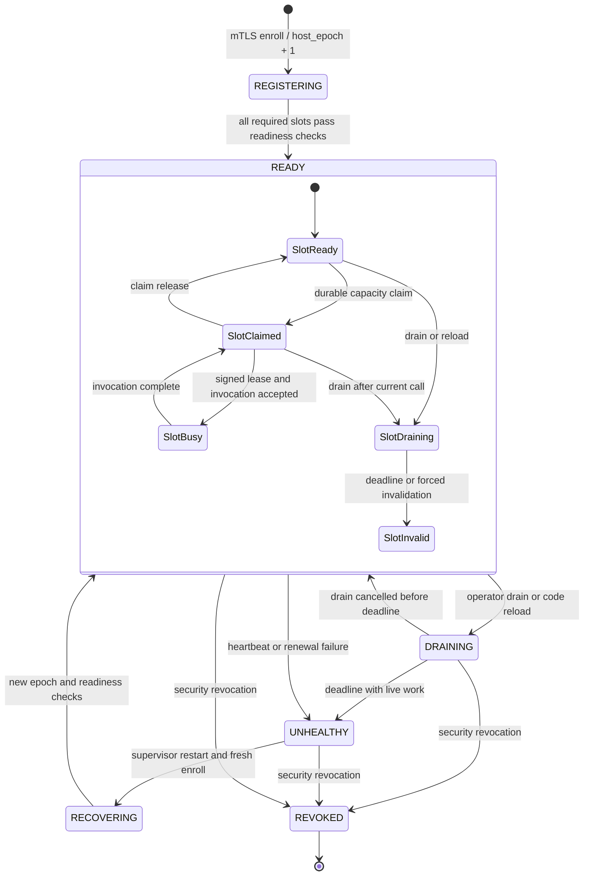

# Instant Execution Control Plane Specification

## Status and scope

This specification defines the v1 control plane for warm executors. It is the
contract between the catalog, application, executor, harness, Redis, and
PostgreSQL implementations. The credential-bearing broker remains outside the
instant execution path.

The existing `POST /api/run` contract remains the batch contract. It continues
to create and report durable batch jobs as documented in
[the server contract](../../server/CONTRACT-ADDENDUM.md). Instant execution is
available only when the catalog entry declares it. The router must not silently
send an instant request to batch. A catalog entry may declare an explicit,
user-visible batch fallback. In that case the response records
`route="batch_fallback"`, a reason code, and the batch job ID.

Redis assists coordination and durability. It is never an execution request,
user-code, request payload, result payload, or per-call routing data path.
PostgreSQL is the durable authority for every security-relevant state change.

The host registry is `executor_hosts` and `executor_slots`. Capacity claims
reserve one ready slot. Session bindings pin a caller session to that claimed
slot. Lease renewal keeps that binding valid for a short, bounded period.

## v1 trust and isolation boundary

v1 runs trusted, read-only user code in prestarted, restricted CPython
processes. The process profile has no network access except its local executor
control socket. It has a read-only code mount, a bounded scratch directory,
CPU, memory, process-count, wall-time, and file-size limits. The executor
starts one call at a time in each process.

This is not proven isolation for hostile multi-tenant code. A tenant may use
instant execution only after the service owner accepts it as trusted code.
Do not describe v1 as a sandbox for arbitrary code.

Promotion to hostile multi-tenant execution requires all of the following:

1. A Wasm runtime with a defined capability model, or an independently audited
   isolate with an equivalent model.
2. Independent evidence that escape, cross-tenant memory access, file access,
   network access, and resource-exhaustion controls meet the threat model.
3. Per-tenant storage and network policies that the runtime enforces, not code
   conventions.
4. A new security review, load test, incident runbook, and catalog version.

## Actors and credential boundaries

| Actor | Can do | Must not hold or receive |
| --- | --- | --- |
| App | Authenticate the caller, resolve the catalog, request an instant binding when a session opens or code changes, and pass the opaque route to the harness. | Executor signing key, Redis password, AWS, Autodesk, Claude, or tenant service credentials. |
| Control-plane service | Own host and slot state, issue leases, bind sessions, and persist accounting outside the invocation response path. | User-code execution capability. It must not import, load, or run user code. |
| Broker | Dispatch the existing batch and APS paths only. It has no role in instant assignment, code load, or invocation. | User-code execution capability. It must not run user code. |
| Executor supervisor | Verify control-plane signatures, manage local CPython processes, and run a lease-bound call from the harness. | Control-plane signing key, PostgreSQL credential, Redis credential, AWS, Autodesk, tenant, broker, or Claude credentials. |
| Restricted CPython process | Read the approved code and its per-call input. | AWS, Autodesk, tenant, Claude, broker, Redis, PostgreSQL, executor mTLS private key, host credential, or filesystem secrets. |
| Harness | Keep a persistent RPC channel to the assigned executor and invoke only the session-bound code with an opaque signed lease. | Signing key, Redis credential, PostgreSQL credential, AWS, Autodesk, tenant service, or broker credentials. |

The control-plane signing private key stays in a dedicated key service and is
not available to the app, harness, executor, broker, or user code. The control
plane publishes only the matching Ed25519 public keys through a versioned trust
bundle. Executors verify signatures locally. The design uses no HMAC and no
signing secret shared with executors.

Each executor has an mTLS identity for its control connection. Its private key
is readable by the supervisor only. The restricted CPython child has a separate
UID and cannot read the identity, supervisor socket, environment, or parent
process memory. Request inputs use an allowlisted schema. They never contain a
credential or opaque upstream authorization header.

## Durable data model

PostgreSQL is the source of truth. All timestamps below are UTC. All state
changes run in one transaction. `version` is incremented on every update.

| Table | Primary key | Required fields and meaning |
| --- | --- | --- |
| `executor_hosts` | `host_id` | `state`, `host_epoch`, `public_key_fingerprint`, `capacity_total`, `capacity_ready`, `last_heartbeat_at`, `drain_deadline_at`, `revoked_at`, `version`. `host_epoch` increases at each accepted registration or forced recovery. |
| `executor_slots` | `(host_id, slot_id)` | `state`, `slot_epoch`, `code_digest`, `runtime_digest`, `current_claim_id`, `last_ready_at`, `version`. A slot represents one CPython process. |
| `capacity_claims` | `claim_id` | `host_id`, `slot_id`, `owner_id`, `claim_epoch`, `state`, `expires_at`, `released_at`, `version`. A partial unique index permits one `ACTIVE` claim per slot. |
| `instant_sessions` | `session_id` | `tenant_id`, `catalog_version`, `code_digest`, `host_id`, `slot_id`, `claim_id`, `binding_epoch`, `state`, `lease_id`, `expires_at`, `invalidated_at`, `reason`, `version`. |
| `executor_leases` | `lease_id` | `host_id`, `slot_id`, `host_epoch`, `slot_epoch`, `claim_id`, `session_id`, `lease_sequence`, `not_before`, `expires_at`, `state`, `revoked_at`, `version`. `lease_sequence` increases for every lease on a slot. |
| `instant_invocations` | `invocation_id` | `session_id`, `lease_id`, `request_hash`, `state`, `accepted_at`, `started_at`, `finished_at`, `outcome_code`, `usage_json`, `version`. The request body is not stored in Redis. |
| `instant_accounting` | `accounting_id` | `invocation_id`, `tenant_id`, `cpu_ms`, `wall_ms`, `memory_peak_bytes`, `input_bytes`, `output_bytes`, `code_digest`, `recorded_at`. A unique constraint on `invocation_id` prevents duplicate charges. |

`host_epoch`, `slot_epoch`, `claim_epoch`, `binding_epoch`, and
`lease_sequence` are fencing values. A lower value is always stale. The
executor records the highest accepted host, slot, and lease values in supervisor
memory. A restart requires fresh registration, which increases `host_epoch` and
clears all local processes before the host can become ready.

## States and transitions

### Host and slot states

Host states are `REGISTERING`, `READY`, `DRAINING`, `UNHEALTHY`, `REVOKED`, and
`RECOVERING`. Slot states are `STARTING`, `READY`, `CLAIMED`, `BUSY`,
`DRAINING`, `INVALID`, and `DEAD`.



### Session and lease states

Session states are `BINDING`, `ACTIVE`, `RENEWING`, `DRAINING`, `INVALID`,
`EXPIRED`, and `REVOKED`. Lease states are `ISSUED`, `ACTIVE`, `EXPIRED`, and
`REVOKED`.

1. The control plane selects a `READY` slot and creates an `ACTIVE` capacity
   claim with a PostgreSQL compare-and-set. It then creates a `BINDING` session.
2. The control plane issues a signed lease only after the executor confirms the
   exact host epoch, slot epoch, code digest, and claim ID.
3. It atomically sets the lease and session to `ACTIVE`. The session binding is
   then available to the app.
4. The control plane renews an active lease before its half-life. It may issue a
   new lease sequence. It never extends an old signed token.
5. Drain moves a session to `DRAINING`. The router accepts no new calls on it.
   Current work may finish before the drain deadline.
6. Invalidation moves the session to `INVALID`, ends the claim, and rejects all
   later calls. Revocation also sets the lease to `REVOKED` and sends a signed
   control command to the executor.
7. Expiry is terminal. A new call needs a new claim, binding, and lease.

## Lease format and validation

The lease is a compact JWS with `alg: "EdDSA"`. The header includes `kid`. The
payload has this exact minimum shape:

```json
{
  "iss": "instant-control-plane",
  "aud": "instant-executor",
  "jti": "lease_01J...",
  "host_id": "host_01J...",
  "slot_id": "slot-3",
  "host_epoch": 42,
  "slot_epoch": 9,
  "claim_id": "claim_01J...",
  "claim_epoch": 17,
  "session_id": "session_01J...",
  "binding_epoch": 4,
  "lease_sequence": 88,
  "catalog_version": 12,
  "code_digest": "sha256:...",
  "runtime_digest": "sha256:...",
  "nbf": 1785252000,
  "exp": 1785252060
}
```

The normal lease lifetime is 60 seconds. The control plane requests renewal at
30 seconds. The executor permits a five-second clock-skew window only for
`nbf`. It rejects a token at or after `exp`. It rejects an unknown `kid`, a bad
signature, an audience mismatch, a stale fencing value, a digest mismatch, a
non-active local slot, or a lease sequence lower than the highest accepted
sequence. A new control connection must first receive the current signed trust
bundle and a fresh host epoch confirmation.

The executor accepts an invocation only over the mutually authenticated harness
channel and only when its invocation envelope repeats the lease ID, session ID,
binding epoch, and request hash. The harness may forward an opaque lease signed
by the control plane, but cannot mint or alter one. The executor never accepts
an invocation or lease from a browser or user-code process.

## Redis coordination keys

Redis values are JSON, except lock values. Keys have an `ix:` prefix. Redis
loss cannot create an authority conflict because PostgreSQL CAS rules decide
the durable result.

| Key | Value shape | TTL | Use |
| --- | --- | --- | --- |
| `ix:host:{host_id}:live` | `{"host_epoch":42,"seen_at":"..."}` | 30 s | Fast liveness hint, refreshed every 10 s. |
| `ix:host:{host_id}:ready` | `{"host_epoch":42,"ready_slots":8,"catalog_version":12}` | 30 s | Fast readiness hint. |
| `ix:claim-lock:{host_id}:{slot_id}` | opaque `claim_id:random_128_bit_nonce` | 10 s | Short contention lock before the PostgreSQL claim transaction. |
| `ix:claim:{claim_id}` | `{"host_id":"...","slot_id":"...","claim_epoch":17,"expires_at":"..."}` | 90 s | Claim discovery and cleanup hint. |
| `ix:session:{session_id}:hint` | `{"host_id":"...","slot_id":"...","binding_epoch":4,"lease_id":"..."}` | 70 s | Invalidation fan-out hint. Never used to route a call. |
| `ix:revoke:{host_id}` | `{"host_epoch":42,"reason":"...","at":"..."}` | 24 h | Best-effort wake-up for a revocation listener. |
| `ix:events:control` | stream entry with `event_id`, `kind`, entity ID, and version | trim at 100,000 entries or 24 h | Best-effort notifications. Consumers reconcile with PostgreSQL. |

The holder may renew `ix:claim-lock` only when its value exactly matches the
original opaque value. It must use an atomic compare-and-expire script. It must
not use the lock as evidence that it owns the slot. The PostgreSQL transaction
must verify that the slot is `READY`, its `version` is the value read, and no
active claim exists. It then updates the slot, inserts the claim, and inserts a
transactional outbox event. A failed CAS loses the race even if the Redis lock
is still held.

The outbox publisher writes hints after commit. It may retry any publish. A
consumer treats every Redis event as a prompt to read the matching PostgreSQL
row by ID and version. It must tolerate duplicate, missing, delayed, and
out-of-order events.

## Readiness, claims, and session routing

An executor becomes ready only after it has:

1. Enrolled through mTLS and received a new `host_epoch`.
2. Loaded the signed control-plane public-key bundle.
3. Created the configured number of restricted CPython processes.
4. Verified each process against the expected runtime and code digests.
5. Completed a non-user-code health probe and reported the result to
   PostgreSQL.

The app asks the control-plane service for a binding before the first instant
call. The control plane reads PostgreSQL and may use Redis only to avoid trying
an obviously dead host. It commits the selected claim, session, and lease in
PostgreSQL. The response contains `session_id`, `binding_epoch`, `lease_id`,
the executor control endpoint, and an opaque call authorization minted for that
one session. It does not expose the executor lease to a browser.

The app passes the binding to the harness on the authenticated `POST /turn`
back-edge. It never returns the executor endpoint, lease, or call authorization
to the browser. The harness verifies the binding shape, opens or reuses a
persistent mutually authenticated RPC channel to the assigned executor, and
sends the invocation directly. Redis, PostgreSQL, the app, the control plane,
the broker, S3, and a queue are not read or written before the executor returns
the result. The executor validates the signed lease, all fencing values, the
code digest, and the invocation envelope locally before entering user code.

The executor reports invocation state and usage to the control plane on a
separate authenticated stream. That stream may be asynchronous and may use a
bounded local journal for retry. It must not delay the direct result unless the
executor cannot durably retain the usage record. PostgreSQL remains the final
authority, and accounting deduplicates by invocation ID.

The session binding is sticky between explicit lifecycle events. The service
must not move a live binding because of load or a transient error. A code
change, host drain, expiry, or recovery may create a replacement binding for
the same user session only after the old binding is invalidated and its epoch
is increased. The app sends the replacement to the harness before another
instant call. This prevents a stale route from becoming a cross-host call.

## Renewal, draining, invalidation, and revocation

The executor sends a signed-by-mTLS heartbeat every 10 seconds. The control
plane writes `last_heartbeat_at` to PostgreSQL at least every 20 seconds and
updates the Redis liveness hint. A heartbeat includes the highest accepted
lease sequence, active invocation ID, process health, and resource counters.

The lease-renewal worker reads active leases with `FOR UPDATE SKIP LOCKED`. It
checks host state, slot state, claim state, code digest, catalog version, and
tenant policy. If all checks pass, it inserts a new lease sequence and changes
the session's `lease_id` in one transaction. It sends the new signed lease over
the control stream. The executor acknowledges its ID and sequence. Lack of an
acknowledgement by expiry changes the session to `EXPIRED` and releases the
claim.

Drain is an operator or deployment action. In one PostgreSQL transaction it:

1. Sets the host or slot to `DRAINING` and sets `drain_deadline_at`.
2. Marks affected sessions `DRAINING`.
3. Stops new claims and new calls to those sessions.
4. Writes an outbox event and sends a signed drain control command.

At the deadline, the service marks remaining sessions `INVALID`, marks their
leases expired, and requests executor cancellation. A controlled drain does not
kill an in-flight call before its deadline unless the caller cancels it or a
security revocation occurs.

Invalidation covers an unhealthy process, code mismatch, a failed integrity
check, a policy change, or an explicit administrative action. It increments the
slot epoch, invalidates every affected session, releases claims, and makes the
slot `INVALID`. The supervisor destroys the process. It must create and pass a
new process before the slot can return to `READY`.

Revocation is stronger than drain. The service commits `REVOKED` state and a
new host or slot epoch, then sends a control-plane-signed `revoke` command on every
live control connection. The supervisor immediately stops the named process,
clears all local session state, and rejects later calls for the old epoch. The
60-second maximum lease life bounds a disconnected executor. The router blocks
new calls as soon as its durable read sees revocation. Redis revocation events
improve speed but are never the enforcement point.

## Crash recovery and split brain

On service start, the reconciler scans PostgreSQL for expired leases, stale
heartbeats, active claims without active sessions, sessions without valid
leases, and incomplete accounting. It performs each repair with a versioned
update and writes an outbox event. It never trusts Redis to reconstruct state.

On executor restart, the supervisor kills any inherited child processes before
it re-enrolls. The registration transaction increases `host_epoch`, invalidates
old sessions and leases for that host, and sets all slots to `STARTING`. A host
cannot report `READY` until the normal readiness sequence completes.

Two control-plane workers may race, but only the transaction that updates the
expected PostgreSQL `version` wins. A worker that loses a CAS drops its work,
reads the committed row, and does not send a lease or control command based on
its stale state. The executor also fences stale commands with host, slot, claim,
binding, and lease sequence values. These two fences handle a duplicated Redis
event, a paused worker, a network partition, or a delayed command.

If an executor sees two controllers, it accepts only the mTLS connection whose
server identity is in the trust bundle and whose command has a valid Ed25519
signature and a strictly newer control sequence. It rejects equal or lower
sequences. If the supervisor loses all trusted control connections for 15
seconds, it stops accepting new calls. It permits an already running call to
finish only until its lease expires.

## Dependency loss behavior

| Failure | Required behavior |
| --- | --- |
| Redis unavailable | Do not create new claims or bindings while the coordination lock service is unavailable. Existing PostgreSQL-valid sessions may complete calls and renew through PostgreSQL. Disable Redis-dependent wake-ups, run the PostgreSQL reconciler more often, and restore hints from the outbox after recovery. |
| PostgreSQL unavailable | Admit no new bindings, claims, renewals, or invalidations. A harness may use an already issued, locally valid lease until it expires. Executors reject later calls. In-flight calls may finish only before expiry and must be marked for accounting reconciliation. |
| Both unavailable | Stop instant admission. Do not fall back to batch unless the catalog explicitly permits the visible batch fallback. |
| Redis returns stale data | Treat it as a hint only. Re-read PostgreSQL before a state change. |
| PostgreSQL failover or ambiguous commit | Do not retry an invocation with the same `invocation_id` until the durable row is known. The unique accounting row and request hash make a retry idempotent. |
| Executor partition | Mark the host unhealthy after 30 seconds without a heartbeat. Do not bind new work. Expire its leases and recover through a new host epoch when it returns. |

## Accounting and exactly-once effects

The executor writes a bounded local idempotency record before entering user
code, then reports it to the control plane on the separate usage stream. The
control plane creates `instant_invocations` with the caller-supplied invocation
ID. The durable unique key is `(tenant_id, invocation_id)`. It stores the
canonical request hash. A repeat with the same hash returns the existing state.
A repeat with a different hash fails with `IDEMPOTENCY_CONFLICT`.

The executor reports measured CPU time, wall time, peak memory, input bytes,
output bytes, exit status, and code digest. The service records terminal
invocation state and one `instant_accounting` row in the same PostgreSQL
transaction. If the executor result arrives after a timeout, the reconciler
queries the executor only through the authenticated control channel and records
the result once. A missing result remains `UNKNOWN`; it is never silently
charged as success or retried as a new execution.

## Code-change reload

Every catalog revision pins `catalog_version`, `code_digest`, and
`runtime_digest`. The control plane does not reload code in a live CPython
process.

For a compatible code change, the control plane claims a ready process, fetches
and validates the immutable artifact through the supervisor, and loads the new
code before it publishes a replacement binding. The old binding is invalidated
and its process is cleared before reuse. Existing calls may finish before the
drain deadline, but no later call may use the old digest.

For an incompatible or security-critical change, the control plane invalidates
old slots and revokes their bindings. The process is destroyed. The user
session may continue only after assignment and code loading produce a new ready
binding. No router may send a call with one digest to a process that reports
another digest.

## API and RPC responsibility matrix

| Operation | Caller | Receiver | Durable action | Response and rejection rule |
| --- | --- | --- | --- | --- |
| `POST /api/run` | App client | App | Existing batch job submission only | Preserve existing `202` and `?wait=1` behavior. It is not an implicit instant route. |
| `POST /api/instant/sessions` | App | Control plane | Create claim, session, and initial lease with CAS | Return binding or explicit `NO_CAPACITY`, `DRAINING`, or dependency error. |
| `ResolveInstantBinding` | App | Control plane | Read the ready binding created at session open or code change | Return an opaque harness-only route. Never return it to the browser. |
| `InvokeInstant` | Harness | Executor | Record idempotency locally, enter the loaded process, and emit usage asynchronously | Direct persistent RPC. Require mTLS, valid Ed25519 lease, exact binding, and matching digests. Never read Redis or PostgreSQL. |
| `ReportInvocationUsage` | Executor | Control plane | Deduplicate and persist terminal state and accounting | Separate authenticated stream. It is not the invocation response path. |
| `EnrollHost` | Executor supervisor | Control plane | Increase host epoch and record capabilities | Require executor mTLS identity and approved host key fingerprint. |
| `ReportReadiness` | Executor supervisor | Control plane | Update slot state with version check | Require matching host and slot epoch plus probe results. |
| `Heartbeat` | Executor supervisor | Control plane | Update durable liveness and outbox | Require mTLS and current host epoch. |
| `RenewLease` | Control plane | Executor supervisor | Insert new lease sequence, then record acknowledgement | Reject if any state, digest, policy, or fence check fails. |
| `DrainHost` / `DrainSlot` | Operator or deployer | Control plane | Set drain state and deadline | Stop new bindings immediately. |
| `InvalidateBinding` | Control plane or policy worker | Control plane | Invalidate session, release claim, increase fence as needed | Return idempotent terminal state. |
| `RevokeExecutor` | Security operator | Control plane and executor | Commit revocation before sending signed command | Stop work immediately. Never wait for Redis delivery. |
| `ReconcileControlPlane` | Scheduled worker | PostgreSQL and executor | Repair expired or inconsistent durable state | Use versioned updates and audit each repair. |

## Required implementation checks

An implementation is conformant only when tests show all of these results:

1. A stale lease, stale host epoch, stale slot epoch, stale binding epoch, and
   stale lease sequence are rejected by the executor.
2. Two concurrent claim attempts create one active PostgreSQL claim and one
   bound session.
3. Redis loss cannot create a duplicate claim and does not put call payloads or
   results in Redis.
4. PostgreSQL loss blocks new instant calls before a new executor lease can be
   used.
5. Revocation stops local execution, invalidates the durable session, and
   blocks a delayed command.
6. A code digest change drains or invalidates old processes. It never reloads a
   live process in place.
7. The restricted CPython process cannot read any credential, connect to Redis
   or PostgreSQL, call AWS or Autodesk, or invoke the broker.
8. An unavailable instant pool produces an explicit failure or an explicitly
   cataloged, visible batch fallback. It never silently changes execution mode.
