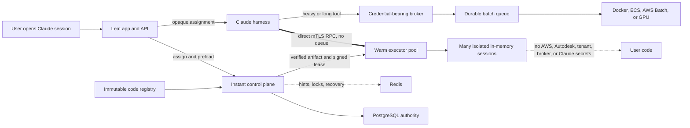
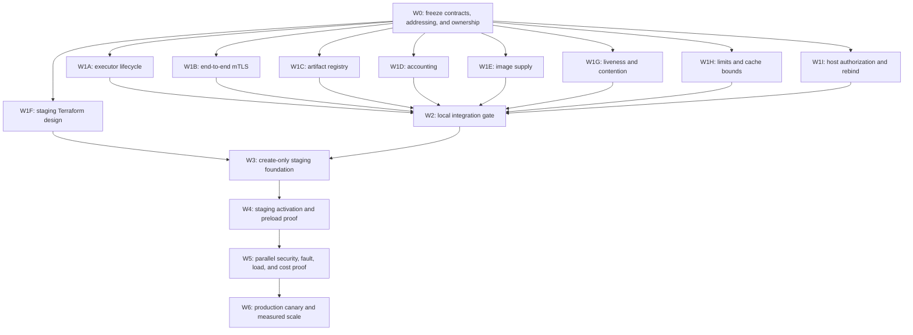

# Warm instant execution: parallel delivery plan

## Decision

Build two execution tiers behind one tool catalog:

- **Instant:** assign a warm isolated executor when the Claude session opens,
  load verified code before the first call, keep it in memory, and invoke it
  through direct authenticated RPC.
- **Batch:** keep the existing durable job path for Docker, ECS, AWS Batch,
  GPU, long-running work, and all arbitrary tenant Python until a hostile-code
  sandbox passes an independent security review.

Redis remains in the control and durability plane. It is not part of the
instant invocation path. The broker remains outside the instant path and never
runs user code.

The design matches the intended topology, but the current branch is not ready
for hostile tenant code or a production rollout. The local vertical path is
substantial. Artifact registry integration, production host lifecycle wiring,
accounting, AWS infrastructure, certificate operations, and live staging proof
remain gates.

## Target architecture

## Evidence from the current source

The following work exists on the compute-pool branch:

- Versioned instant contracts and a control-plane specification.
- App session assignment and catalog routing.
- A PostgreSQL-backed control plane with fencing values, leases, claims,
  renewal, reaping, and Redis coordination hints.
- A warm multi-slot executor that loads code before invocation and holds it in
  child-process memory.
- Direct harness-to-executor HTTP RPC with connection reuse.
- A separate batch fallback that retains the existing `POST /api/run` job path.
- Local contract, integration, latency, and capacity checks.
- Production composition and mTLS hardening are present as uncommitted work and
  still need an integration gate.

The following points remain incomplete or unproven:

1. The current load request carries source text. A real immutable code registry
   fetch, signature check, digest check, cache, and revocation path do not exist.
2. The restricted CPython child clears its environment and limits built-ins,
   but it uses `exec`. This reduces accidental access by trusted code. It is not
   hostile multi-tenant isolation.
3. Automatic executor registration exists as a separate module, but service
   lifecycle integration and failure behavior need a single-owner merge and
   full regression run.
4. Runtime and harness mTLS need one end-to-end certificate handshake test after
   their independently owned changes merge.
5. Durable invocation usage and billing records are specified but not yet wired
   through the runtime, control plane, and product ledger.
6. The AWS task definitions, private service discovery, security groups, secret
   shells, certificate population workflow, dashboards, and alarms do not yet
   exist for instant execution.
7. No live staging evidence proves assignment time, code-load time, 20 to 100 ms
   trivial-call latency, host density, recovery, or cost.
8. Live AWS cost and inventory reads require a renewed non-root SSO session.
9. The control plane records heartbeats, but slot selection does not yet reject
   a host whose heartbeat is stale.
10. Concurrent code-change rebinds can read the same binding epoch before the
    single-flight section, and concurrent assignments can contend on the first
    ordered slot instead of spreading and retrying.
11. Catalog CPU, memory, process, and tool-call limits are not enforced at the
    operating-system boundary. The in-memory idempotency cache is also unbounded.
12. Host registration and app control calls currently share one API secret.
    Host enrollment needs a separate mTLS identity and authorization policy.
13. A scaled AWS pool still needs a host-specific private addressing decision.
    Ordinary Cloud Map service DNS load balances tasks and does not guarantee
    that a harness call reaches the slot named in its lease.

## Component ownership map

| Component | Required change | Primary lane |
| --- | --- | --- |
| Claude harness | Accept only an authenticated opaque assignment, keep an mTLS connection pool, enforce deadline and cancellation, call instant RPC directly, and send heavy work to batch | 1B |
| App and API | Assign and preload on session open, rebind on code change, hide executor details from the browser, and keep a feature flag plus batch fallback | App integration owner in Wave 2 |
| Broker | Preserve the current durable batch API and remove it from all instant assignment and invocation flows | Batch regression owner in Wave 2 |
| Session routing | Store the authoritative binding in PostgreSQL, return a short-lived signed lease, cache the opaque route in the app, and never query Redis for a warm call | Control-plane owner in 1A and Wave 2 |
| Code registry | Store immutable signed artifacts, resolve by tenant and catalog version, validate digest and capability, cache verified bytes, and support revocation | 1C |
| Warm executor pool | Register many slots per host, preload one session per slot, keep code in memory, enforce fencing and bounds, expose readiness, and drain safely | 1A |
| Redis | Hold liveness hints, short contention locks, invalidation fan-out, and recovery events only | Control-plane owner in Wave 2 |
| Persistence | Apply ordered PostgreSQL migrations for hosts, slots, claims, sessions, leases, invocations, outbox, and accounting | Database owner in 1D |
| Authentication and isolation | Use service mTLS plus Ed25519 leases, keep credentials out of the executor child, deny network by infrastructure policy, and restrict CPython to trusted code | 1B and Wave 5 security |
| Observability and billing | Correlate session, assignment, lease, invocation, host, and batch job IDs; record bounded usage once; publish SLO and cost dashboards | 1D, 1F, and Wave 5 cost |

## Dependency graph and critical path

The critical path is the host-specific addressing decision, executor lifecycle
and trust integration, local integration, create-only staging foundation,
staging activation, live proof, then production canary. Code registry work is
also on the critical path unless the first staging canary is explicitly limited
to one checked-in trusted platform tool.

## Wave 0: freeze interfaces and split ownership

**Maximum useful concurrency:** 3 decision lanes, then 1 integrator.

**Elapsed target:** half a working day.

Three read-only lanes run first:

1. Decide how an assignment reaches one exact executor host over a private
   network while preserving mTLS identity. Compare per-task private IP plus
   identity-aware certificate verification, dynamic host-specific private DNS,
   and a dedicated in-memory RPC router. Measure connection setup and state the
   reason for rejecting each alternative. Do not assume service-level DNS can
   route a host-bound lease.
2. Record the trusted-only CPython boundary and run an isolation spike outside
   the staging critical path. Compare Wasm, isolates, and restricted prestarted
   processes. Tenant-authored Python remains batch-only regardless of the spike
   schedule.
3. Capture the exact baseline test commands, source SHA, exit codes, and current
   failures before later lanes change the branch.

The integrator then freezes the v1 JSON contracts, environment variable names,
ports, health endpoints, metrics names, database migration ownership, addressing
contract, and two tool contracts. Each later lane receives exclusive
logical-file ownership. No worker may spawn another worker or edit a shared
contract without returning the change to the integrator.

The accepted staging decision is
[private task IP plus a fixed verified TLS server name](HOST-ADDRESSING-DECISION.md).

Gate W0:

- Contract validator passes.
- Instant and batch routing rules are explicit.
- The security boundary says trusted platform code only for CPython.
- The AWS resource names, ports, secret names, and image command matrix are
  recorded before application and Terraform work diverge.
- One host-specific private addressing and mTLS identity design is accepted
  with a measured connection-setup result.
- Baseline evidence is attached to the plan.

Rollback boundary: documentation and contracts only.

## Wave 1: close independent local gaps

**Maximum useful concurrency:** 9 lanes.

**Elapsed target:** one to two working days.

| Lane | Exclusive scope | Output | Acceptance gate |
| --- | --- | --- | --- |
| 1A, executor lifecycle | `executor/runtime/registration.py`, its tests, then a serialized integrator edit to `service.py` | Register host and slots before serving, heartbeat, drain, retry, and clean shutdown | Registration unit tests, supervisor integration test, mismatch fails startup, loss of control plane makes host unavailable |
| 1B, mTLS path | Harness instant client and tests; runtime TLS tests remain under runtime owner | Verified CA plus client certificate on harness RPC, loopback-only cleartext | Real TLS handshake passes, wrong CA and missing client cert fail, no insecure fallback |
| 1C, code registry | New registry adapter, artifact policy, cache, revocation tests, and app catalog adapter | Executor receives verified immutable bytes by digest, not arbitrary inline tenant source | Changed bytes, signature, digest, tenant, catalog version, or revoked artifact fail closed |
| 1D, accounting | New usage event and durable accounting modules plus migrations owned by the database lane | Idempotent invocation and usage ledger outside the response critical path | Duplicate invocation cannot double charge, lost Redis does not lose durable accounting, payloads and secrets are absent |
| 1E, image supply | `deploy/Dockerfile.instant-execution`, its workflow, and static tests | One immutable non-root image with explicit control, reaper, and executor commands | Test and scan before push, commit tag only, read-only root compatible, workflow never deploys |
| 1F, staging design | New staging-only Terraform files and tests in the infrastructure repository | ECR, two task definitions, two ECS services, private DNS, least-privilege roles, logs, alarms, and secret shells | `terraform fmt`, validate, static policy tests, and full refreshed plan with no unexplained action |
| 1G, liveness and contention | `executor/control_plane/store.py` and its store tests | Reject stale hosts, spread candidate selection, and retry bounded compare-and-set conflicts | Backdated heartbeat removes a host; 64 concurrent assignments on 64 ready slots produce no avoidable capacity error |
| 1H, runtime bounds | `executor/runtime/child.py`, `supervisor.py`, and their tests | Enforce CPU, memory, process, file, wall, and output limits; bound idempotency by TTL and size | Allocation or CPU bomb kills only its child; the host stays ready; cache size remains bounded under a long run |
| 1I, host auth and rebind | `executor/control_plane/api.py`, `service.py`, and focused tests | Separate host enrollment authorization, validate request bodies, and put rebind epoch allocation inside one lock | App secret alone cannot register a host; malformed JSON cannot produce an unhandled error; concurrent rebinds receive unique fencing values |

Lane 1F may start as soon as the frozen environment, port, and addressing
contracts exist. It must not wait for application code to finish. This is the
largest wall-clock saving in the plan. The tenant-code isolation spike also runs
in parallel and remains outside the trusted-only staging critical path.

## Wave 2: local integration and falsification gate

**Maximum useful concurrency:** 1 writer plus 4 read-only test lanes.

**Elapsed target:** one working day.

The integrator merges the nine lanes in this order: contracts, migrations,
control-plane store, control-plane service and API, runtime supervisor and
limits, runtime lifecycle, harness, registry, then image. Test lanes then run in
parallel:

1. Server and app regression suite.
2. Harness typecheck, build, and tests.
3. Control-plane, PostgreSQL contract, runtime, mTLS, and reconciliation tests.
4. Container contract, workflow static checks, benchmark validator, and secret
   scan.

Gate W2:

- All existing suites pass.
- A single local test opens a session, assigns a slot, loads verified code once,
  invokes the same trivial tool at least 100 times, renews the lease, changes
  code, reloads, and tears down the session.
- Direct invocation continues when Redis is unavailable after assignment.
- The broker and its credentials are absent from the executor process tree.
- Direct RPC startup p95 is below 10 ms on the local test network.
- The branch has no partial mTLS configuration path and no source-by-value path
  outside an explicit trusted-development fixture.
- A regression test proves that tenant-supplied Python cannot enter the instant
  loader while CPython remains the runtime.
- A dead host stops receiving assignments within one heartbeat expiry window.
- A resource bomb in one slot does not crash or starve another slot.
- The app credential cannot enroll a host, and one host identity cannot enroll
  a different host ID.

Any shared-file failure returns to the owning lane. The integrator does not let
multiple workers patch the same file concurrently.

Rollback boundary: one application commit series, no cloud state.

## Wave 3: create-only staging foundation

**Maximum useful concurrency:** 3 preparation lanes, then 1 Terraform state
writer.

**Elapsed target:** one to two working days, assuming AWS access is ready.

Preparation lanes run in parallel:

- Build and push the immutable image through the protected OIDC workflow.
- Review the full staging Terraform plan and policy output.
- Generate certificate and secret material through a protected out-of-band
  workflow. Terraform creates secret shells only and never stores private values.

The single state writer then applies only the reviewed staging plan. Initial
service desired counts remain zero. Use separate control-plane and executor
tasks because Fargate containers in one task share a task role and network
boundary. Run the reaper as a sidecar in the control task to avoid a third idle
service.

Reuse the existing Aurora and Redis only after connection, TLS, namespace, and
capacity tests pass. Do not add Redis or PostgreSQL to the direct invocation
path.

Gate W3:

- Named, non-root AWS identity and `us-east-1` are confirmed.
- Repository head, remote state, import ledger, rollback commands, and the full
  refreshed plan match the production reconciliation rules.
- Services exist at zero, image digests are immutable, secrets are populated,
  and task roles hold no AWS, Autodesk, Claude, tenant, broker, Redis, or
  PostgreSQL credentials unless the component explicitly needs one.
- No public executor endpoint exists.
- A lease-bound request reaches the exact assigned host under at least two
  running executor tasks. Service-level load balancing is not accepted as proof.

Rollback boundary: set service counts to zero, retain logs and database rows,
then revert only the reviewed Terraform resources through the protected state
workflow.

## Wave 4: staging activation and first-call proof

**Maximum useful concurrency:** 2 activation owners plus 3 observers.

**Elapsed target:** one working day.

Activate one control task and one executor host. Keep the Leaf app feature flag
off for normal users. Run a synthetic session through the real app and harness.
The session-open path must assign a slot, fetch and validate the artifact, load
it, and return an opaque route before the first tool call.

Gate W4:

- Host registration, slot readiness, assignment, code load, renewal, drain, and
  recovery appear in durable state and traces.
- Executor assignment p95 is at most 250 ms when warm.
- Cached artifact validation and load p95 is at most 500 ms for the agreed small
  artifact size. This occurs before the first call and is not part of invocation
  startup.
- Instant invocation startup p95 is below 10 ms at the executor.
- A trivial end-to-end tool returns p50 at most 50 ms and p95 at most 100 ms
  from the harness in the same AWS region.
- A heavy tool returns a batch job ID within 500 ms and completes through the
  existing durable tier.
- Redis loss after assignment does not stop instant calls. PostgreSQL loss does
  stop new assignments and renewals without corrupting an active lease.

Rollback boundary: disable the app feature flag and scale both instant services
to zero. Batch behavior remains unchanged.

## Wave 5: parallel proof lanes

**Maximum useful concurrency:** 5 lanes.

**Elapsed target:** two to three working days.

| Lane | Proof | Readiness is falsified by |
| --- | --- | --- |
| Security | Credential canaries, network denial, filesystem denial, cross-tenant access, mTLS rotation, replay, stale fencing, and revocation | Any credential reaches child code, any public route exists, or one tenant reads another tenant's data |
| Reliability | Kill control task, executor task, child process, Redis connection, and PostgreSQL connection; test drain and recovery | Split ownership, duplicate active slot claims, stale lease acceptance, or unrecoverable session mapping |
| Capacity | Increase sessions per host until CPU, memory, queueing, or latency breaks; repeat with mixed code sizes | p95 exceeds SLO before the declared safe capacity or one session starves others |
| Latency | At least 10,000 warm trivial calls, cold session opens, code changes, lease renewal, and cross-AZ paths | Invocation p95 over 100 ms or startup p95 over 10 ms at target concurrency |
| Cost and billing | Match durable usage rows to CloudWatch and AWS cost data; measure idle and loaded task cost | Double charges, missing usage, unknown shared-cost allocation, or measured idle cost above the approved cap |

Start with 8 slots on a 0.5 vCPU, 1 GB executor only as a test hypothesis. The
safe session density is the measured point before p95 latency or memory fails,
with a 30 percent reserve. Do not treat the configured slot count as capacity
evidence.

Idle behavior:

- Keep a small regional floor of one warm executor host only during the staging
  proof window.
- Release a session slot after 15 minutes without activity, subject to product
  telemetry. Renew active leases every 30 seconds with a 60-second lifetime.
- Scale production from observed concurrent sessions and assignment pressure,
  not invocation queue depth.
- Keep batch workers and GPUs at zero when their queues are empty if startup SLOs
  permit it.

The first cost hypothesis is about $27 per month for one always-on 0.25 vCPU,
0.5 GB control task and one 0.5 vCPU, 1 GB executor task in `us-east-1`, before
logs, network, and shared data services. This is a planning estimate, not a bill.
Reuse of existing Aurora and Redis avoids new fixed data-service cost, but live
Cost Explorer evidence remains required.

## Wave 6: production canary and scale

**Maximum useful concurrency:** 1 production change owner plus 4 observers.

Production work begins only after all Wave 5 reports pass and a named approver
accepts the measured cost and trusted-code limitation.

Roll out in this order:

1. Production create-only resources at desired count zero through the protected
   import and state workflow.
2. One control task and one executor host, with no user traffic.
3. Internal synthetic traffic.
4. One allowlisted trusted platform tool and one internal tenant.
5. Five percent, then twenty-five percent, then full eligible traffic, with a
   hold and rollback check at each step.

Gate W6:

- Seven consecutive days within latency, error, security, and cost budgets.
- No unaccounted invocation and no duplicate charge.
- Batch fallback remains healthy.
- On-call dashboards, alerts, certificate rotation, drain, rollback, and
  incident runbooks have completed rehearsals.

## Work that must serialize

The following work does not become safer or faster with more writers:

- Contract and schema changes.
- The host-addressing architecture decision.
- Edits to runtime `service.py` that join TLS, registration, and supervisor
  lifecycle.
- Database migration ordering.
- Integration commits that touch app-to-harness assignment headers.
- Terraform changes in one staging or production state.
- Secret and certificate population.
- Service activation, traffic promotion, and rollback.
- Production cost actions such as changing GPU ASG minimums.

Review and test lanes may run beside these changes, but only one owner writes
each boundary.

## Instant and batch contracts

### Instant tool

- Catalog declares `execution_class: "instant"`, runtime, immutable artifact
  digest, entry point, parameter schema digest, capability, limits, and optional
  explicit batch fallback.
- Session open or code change returns an opaque signed assignment only after a
  warm slot has loaded the verified artifact.
- Invocation uses direct mTLS RPC with assignment, lease, invocation ID,
  request hash, bounded parameters, and a deadline.
- Response is synchronous and bounded. It includes result, usage, route, and
  stable error code. It never contains credentials or infrastructure details.
- No Docker start, Redis queue operation, artifact fetch, or database lookup is
  required for a normal warm invocation.

### Batch tool

- Catalog declares `execution_class: "batch"` or an explicit instant fallback.
- Submission uses the existing authenticated app and broker path.
- Response returns a durable job ID and status URL quickly.
- Redis or another durable queue may schedule Docker, ECS, AWS Batch, GPU, or
  long-running work.
- Status, cancellation, retry, result retention, usage, and billing are durable
  and idempotent.

## Final readiness statement

The architecture is ready to implement in parallel, but it is not ready to
claim arbitrary user-code safety or production latency. Readiness requires
measured staging evidence. Model agreement, local mocks, configured slot counts,
and Terraform plans are not substitutes for that evidence.
